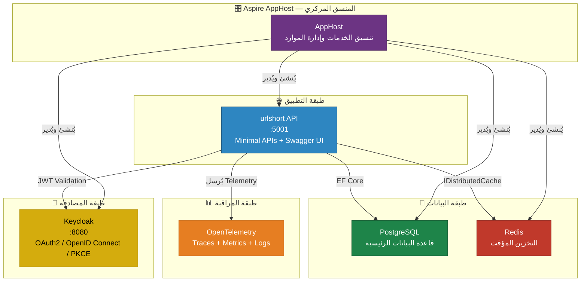
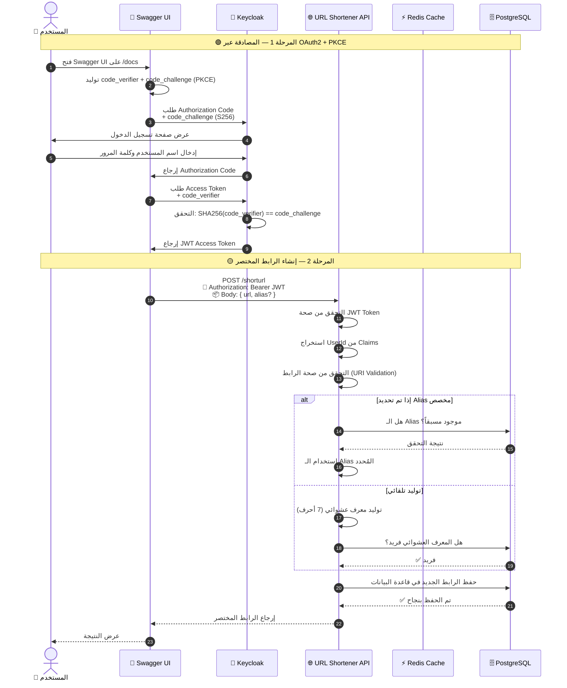
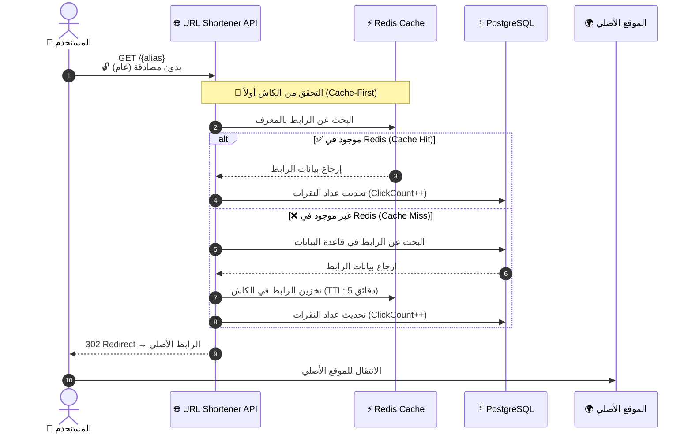
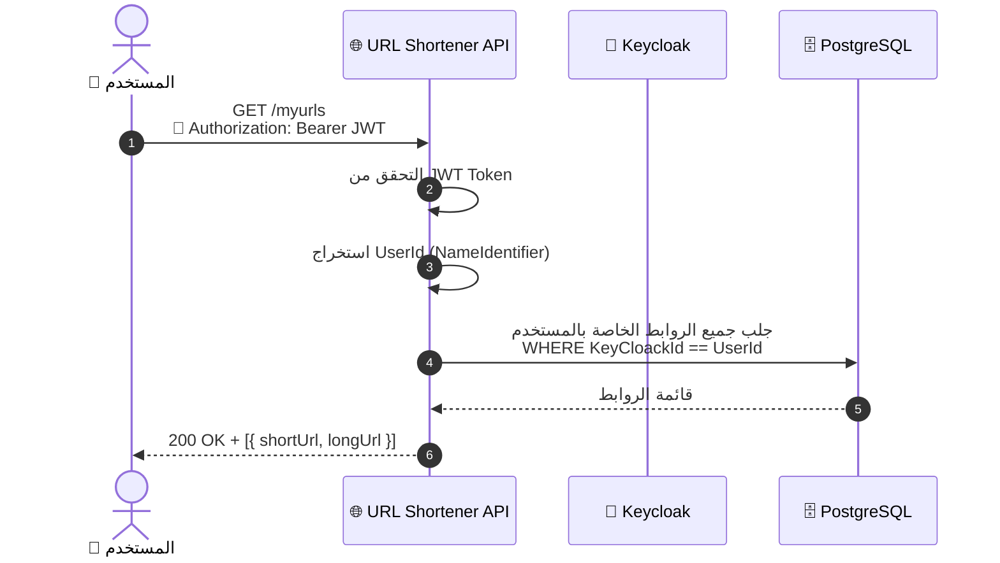
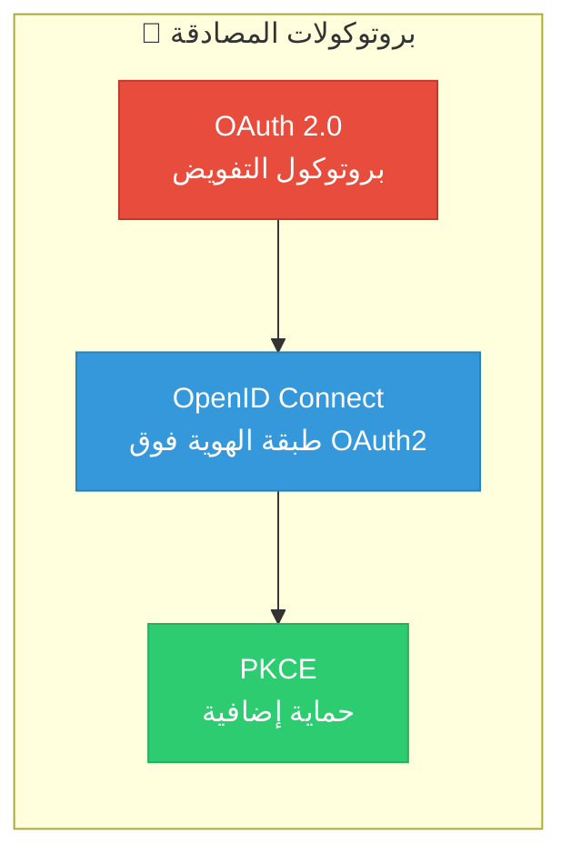
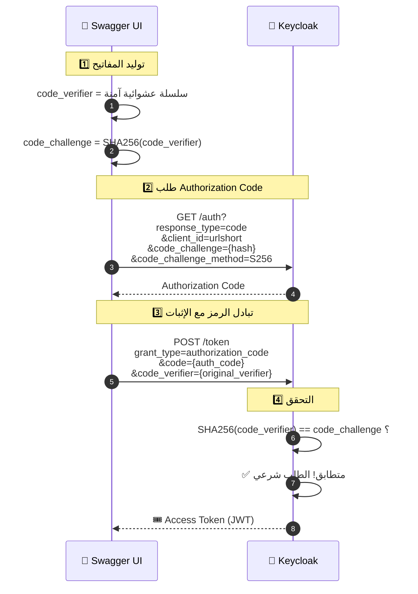
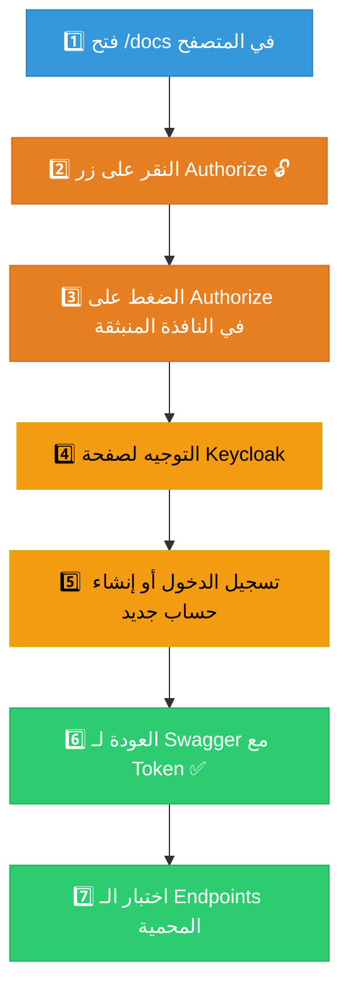
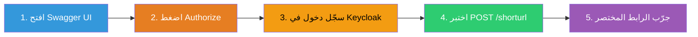

<div dir="rtl" align="right">

<div align="center">

# 🔗 خدمة تقصير الروابط — URL Shortener

### مشروع Microservice مبني بـ .NET Aspire مع مصادقة Keycloak

[](https://dotnet.microsoft.com/)
[](https://learn.microsoft.com/en-us/dotnet/aspire/)
[](https://www.keycloak.org/)
[](https://www.postgresql.org/)
[](https://redis.io/)
[](https://swagger.io/)

</div>

---

## 📋 فهرس المحتويات

- [نظرة عامة](#-نظرة-عامة)
- [الهندسة المعمارية — Architecture](#-الهندسة-المعمارية--architecture)
- [خريطة تدفق البيانات ثلاثية الأبعاد](#-خريطة-تدفق-البيانات-ثلاثية-الأبعاد)
- [وصف الخدمات](#-وصف-الخدمات)
- [المصادقة والتفويض — Keycloak](#-المصادقة-والتفويض--keycloak)
- [واجهة Swagger UI](#-واجهة-swagger-ui)
- [نقاط النهاية — API Endpoints](#-نقاط-النهاية--api-endpoints)
- [بنية المشروع](#-بنية-المشروع)
- [التشغيل — Getting Started](#-التشغيل--getting-started)
- [التقنيات المستخدمة](#-التقنيات-المستخدمة)

---

## 🌟 نظرة عامة

مشروع **URL Shortener** هو خدمة تقصير روابط احترافية مبنية باستخدام **بنية الخدمات الموزعة (Distributed Architecture)** عبر **.NET Aspire**. يوفر المشروع:

- ✅ **تقصير الروابط** — تحويل الروابط الطويلة إلى روابط قصيرة فريدة
- ✅ **اختصار مخصص (Alias)** — إمكانية اختيار اسم مختصر يدوياً
- ✅ **تتبع النقرات** — عداد لعدد النقرات على كل رابط
- ✅ **مصادقة آمنة** — عبر Keycloak مع بروتوكول OAuth 2.0 / OpenID Connect
- ✅ **حماية PKCE** — لمنع هجمات اعتراض Authorization Code
- ✅ **تخزين مؤقت ذكي** — باستخدام Redis لتسريع إعادة التوجيه
- ✅ **مراقبة شاملة** — عبر OpenTelemetry (Traces, Metrics, Logs)

---

## 🏗 الهندسة المعمارية — Architecture

يعتمد المشروع على **بنية Aspire الموزعة** حيث يقوم `AppHost` بتنسيق جميع الخدمات:



---

## 🗺️ خريطة تدفق البيانات ثلاثية الأبعاد

### 🔄 تدفق إنشاء رابط مختصر (POST `/shorturl`)



### 🔄 تدفق إعادة التوجيه (GET `/{alias}`)



### 🔄 تدفق عرض روابط المستخدم (GET `/myurls`)



---

## 📦 وصف الخدمات

### 1️⃣ 🎛️ Aspire AppHost — المنسق المركزي

> **المسار:** `urlshort.AppHost/AppHost.cs`

**ما هو .NET Aspire؟**
هو إطار عمل من Microsoft لبناء تطبيقات سحابية موزعة. يُبسّط عملية تنسيق الخدمات المتعددة (Orchestration) ويوفر لوحة تحكم مركزية لمراقبة جميع الموارد.

**ما يفعله AppHost في هذا المشروع:**

| الوظيفة | الوصف | الكود |
|---------|-------|-------|
| 🗄️ إدارة PostgreSQL | إنشاء حاوية PostgreSQL مع قاعدة بيانات `urlshortening` | `builder.AddPostgres("postgres").AddDatabase("urlshortening")` |
| ⚡ إدارة Redis | إنشاء حاوية Redis للتخزين المؤقت | `builder.AddRedis("mycache")` |
| 🔐 إدارة Keycloak | إنشاء حاوية Keycloak على المنفذ `8080` | `builder.AddKeycloak("keycloak", 8080)` |
| 🌐 تسجيل الـ API | ربط المشروع بجميع الموارد + إعداد Swagger | `builder.AddProject<Projects.urlshort>("urlshort")` |
| 📥 استيراد الـ Realm | استيراد إعدادات Keycloak تلقائياً عند التشغيل | `keycloak.WithRealmImport("./realms")` |
| 💾 حفظ البيانات | استخدام Data Volumes لحفظ البيانات بين عمليات إعادة التشغيل | `.WithDataVolume()` |
| ⏳ ترتيب البدء | انتظار جاهزية كل خدمة قبل بدء الخدمة التالية | `.WaitFor(postgres).WaitFor(cache).WaitFor(keycloak)` |

```csharp
// AppHost.cs — نقطة التنسيق المركزية
var postgres = builder.AddPostgres("postgres").WithDataVolume().AddDatabase("urlshortening");
var cache = builder.AddRedis("mycache").WithDataVolume();
var keycloak = builder.AddKeycloak("keycloak", 8080).WithDataVolume();

builder.AddProject<Projects.urlshort>("urlshort")
    .WithReference(postgres)    // ربط قاعدة البيانات
    .WithReference(cache)       // ربط الكاش
    .WithReference(keycloak)    // ربط المصادقة
    .WaitFor(postgres)          // انتظر PostgreSQL
    .WaitFor(cache)             // انتظر Redis
    .WaitFor(keycloak);         // انتظر Keycloak
```

---

### 2️⃣ 🌐 urlshort API — خدمة تقصير الروابط

> **المسار:** `urlshort/`

الخدمة الأساسية التي تُدير عمليات تقصير الروابط وإعادة التوجيه. مبنية بنمط **Minimal APIs** لأقصى أداء ممكن.

| المكون | الوصف | المسار |
|--------|-------|--------|
| `Program.cs` | نقطة البدء — تسجيل الخدمات والـ Middleware | `urlshort/Program.cs` |
| `EndpointMap.cs` | تعريف جميع نقاط النهاية (Endpoints) | `urlshort/Endpoints/EndpointMap.cs` |
| `Url.cs` | الموديل الرئيسي — Entity Framework | `urlshort/Models/Url.cs` |
| `ApplicationDbContext.cs` | سياق قاعدة البيانات (EF Core) | `urlshort/Data/ApplicationDbContext.cs` |
| `RedisCache.cs` | طبقة التخزين المؤقت | `urlshort/Cache/RedisCache.cs` |
| `RandomizedCharachters.cs` | مولد المعرفات العشوائية الفريدة | `urlshort/Helpers/RandomizedCharachters.cs` |

**نموذج البيانات (Url Entity):**

```csharp
public class Url
{
    public string Id { get; set; }           // المعرف المختصر (alias)
    public Guid KeyCloackId { get; set; }    // معرف المستخدم من Keycloak
    public string LongUrl { get; set; }      // الرابط الأصلي
    public string ShortUrl { get; set; }     // الرابط المختصر الكامل
    public int ClickCount { get; set; }      // عداد النقرات
}
```

---

### 3️⃣ ⚡ Redis Cache — التخزين المؤقت

> **نمط Cache-First Pattern**

عند طلب إعادة التوجيه (`GET /{alias}`)، يتحقق النظام **أولاً** من Redis قبل الذهاب لقاعدة البيانات:

```
المستخدم → API → Redis (5 دقائق TTL)
                    ↓ (Cache Miss)
                  PostgreSQL → Redis (تخزين) → المستخدم
```

| الإعداد | القيمة |
|---------|--------|
| مدة انتهاء الصلاحية (TTL) | 5 دقائق |
| التسلسل | `System.Text.Json` |
| نوع الكاش | `IDistributedCache` |

---

### 4️⃣ 🗄️ PostgreSQL — قاعدة البيانات

| الإعداد | القيمة |
|---------|--------|
| اسم قاعدة البيانات | `urlshortening` |
| ORM | Entity Framework Core 10 |
| Provider | `Npgsql.EntityFrameworkCore.PostgreSQL` |
| الهجرات | تلقائية عند بدء التشغيل (Auto Migration) |

التهجير التلقائي عند التشغيل:

```csharp
// تنفيذ الهجرات المعلقة تلقائياً عند بدء التطبيق
if ((await context.Database.GetPendingMigrationsAsync()).Any())
{
    await context.Database.MigrateAsync();
}
await context.Database.EnsureCreatedAsync();
```

---

### 5️⃣ 🛡️ ServiceDefaults — الخدمات المشتركة

> **المسار:** `urlshort.ServiceDefaults/Extensions.cs`

مكتبة مشتركة تُضيف الخدمات الأساسية لكل مشروع في الحل:

| الخدمة | الوصف |
|--------|-------|
| **OpenTelemetry** | مراقبة شاملة (Traces, Metrics, Logs) |
| **Health Checks** | فحص صحة التطبيق على `/health` و `/alive` |
| **Service Discovery** | اكتشاف الخدمات تلقائياً |
| **Resilience** | معالجة الأخطاء وإعادة المحاولة (Polly) |

---

## 🔐 المصادقة والتفويض — Keycloak

### ما هو Keycloak؟

**Keycloak** هو خادم مصادقة وتفويض مفتوح المصدر من Red Hat. يُوفر إدارة كاملة للهوية والوصول (IAM — Identity & Access Management).

### بروتوكولات المصادقة المُستخدمة



### 🔑 OAuth 2.0 — بروتوكول التفويض

**OAuth 2.0** هو بروتوكول تفويض يُتيح لتطبيق ما (مثل Swagger UI) الوصول إلى موارد المستخدم بدون الحصول على كلمة المرور مباشرة.

**التدفق المُستخدم: Authorization Code Flow**

هذا هو **الأكثر أماناً** بين تدفقات OAuth2، حيث يتم تبادل الرموز عبر القناة الخلفية (Back-Channel).

| الخطوة | الوصف |
|--------|-------|
| 1 | يُوجَّه المستخدم إلى صفحة تسجيل الدخول في Keycloak |
| 2 | المستخدم يُدخل بياناته (اسم مستخدم + كلمة مرور) |
| 3 | Keycloak يُعيد **Authorization Code** إلى التطبيق |
| 4 | التطبيق يُبادل الـ Code بـ **Access Token** |
| 5 | يُستخدم الـ Token لاستدعاء الـ API |

### 🆔 OpenID Connect (OIDC)

**OpenID Connect** هو طبقة هوية مبنية **فوق** OAuth 2.0. بينما OAuth2 يُركز على **التفويض** (ماذا يمكنك فعله؟)، OIDC يُضيف **المصادقة** (من أنت؟).

| الميزة | OAuth 2.0 | OpenID Connect |
|--------|-----------|----------------|
| **الهدف** | تفويض الوصول | تحقق من الهوية |
| **الرمز** | Access Token | ID Token + Access Token |
| **المعلومات** | الصلاحيات فقط | بيانات المستخدم (claims) |
| **الاكتشاف** | لا يوجد | `.well-known/openid-configuration` |

**Endpoints المُعرّفة في Keycloak:**

```
🔗 Authorization URL:
   https://localhost:8080/realms/urlshort/protocol/openid-connect/auth

🔗 Token URL:
   https://localhost:8080/realms/urlshort/protocol/openid-connect/token

🔗 OIDC Discovery:
   https://localhost:8080/realms/urlshort/.well-known/openid-configuration
```

**النطاقات (Scopes) المُستخدمة:**

| النطاق | الوصف |
|--------|-------|
| `openid` | مطلوب لبروتوكول OIDC — يُفعّل الحصول على ID Token |
| `profile` | الوصول لبيانات الملف الشخصي (الاسم، الصورة، ...) |

### 🛡️ PKCE — حماية Authorization Code

> **PKCE** = **P**roof **K**ey for **C**ode **E**xchange (مفتاح إثبات لتبادل الرمز)

**لماذا PKCE؟**

في تطبيقات **Public Client** (مثل SPA أو Swagger UI)، لا يوجد **Client Secret** لحماية طلب التبادل. بدون PKCE، يمكن لمهاجم اعتراض الـ Authorization Code واستخدامه للحصول على Token.

**كيف يعمل PKCE في هذا المشروع:**



**إعدادات PKCE في Keycloak (realm-export.json):**

```json
{
  "clientId": "urlshort",
  "publicClient": true,
  "standardFlowEnabled": true,
  "attributes": {
    "pkce.code.challenge.method": "S256"
  }
}
```

**إعدادات PKCE في Swagger UI (Program.cs):**

```csharp
app.UseSwaggerUI(c =>
{
    c.OAuthClientId("urlshort");    // Public Client — بدون Secret
    c.OAuthUsePkce();               // تفعيل PKCE تلقائياً
});
```

### ⚙️ إعدادات عميل Keycloak

| الإعداد | القيمة | الوصف |
|---------|--------|-------|
| **Client ID** | `urlshort` | معرف العميل |
| **Client Type** | `Public Client` | بدون Client Secret |
| **Protocol** | `openid-connect` | بروتوكول OIDC |
| **Standard Flow** | `مُفعّل` | Authorization Code Flow |
| **PKCE Method** | `S256` | SHA-256 Challenge |
| **Redirect URI** | `https://localhost:5001/*` | عنوان إعادة التوجيه |
| **Web Origins** | `*` | السماح بجميع المصادر (CORS) |
| **Registration** | `مُفعّل` | يُمكن للمستخدمين التسجيل ذاتياً |
| **Token Lifetime** | `300 ثانية` | مدة صلاحية Access Token |

### 🔍 التحقق من JWT في الـ API

```csharp
builder.Services.AddAuthentication(JwtBearerDefaults.AuthenticationScheme)
    .AddJwtBearer(options =>
    {
        // مصدر التوكن — Keycloak Realm
        options.Authority = "https://localhost:8080/realms/urlshort";
        
        // الجمهور المستهدف
        options.Audience = "account";
        
        // في بيئة التطوير، لا نشترط HTTPS لـ Metadata
        options.RequireHttpsMetadata = false;
    });
```

---

## 📘 واجهة Swagger UI

### ما هو Swagger UI؟

واجهة ويب تفاعلية تُتيح **استكشاف واختبار** نقاط النهاية (API Endpoints) مباشرة من المتصفح. في هذا المشروع، تم دمجها مع **OAuth2 + PKCE** للمصادقة المباشرة.

### الوصول

```
📍 العنوان: https://localhost:{port}/docs
```

> يظهر أيضاً كرابط مباشر **"API Docs"** في لوحة تحكم Aspire Dashboard.

### كيفية استخدام Swagger مع المصادقة



### إعدادات Swagger في الكود

```csharp
// تعريف OAuth2 Security في Swagger
builder.Services.AddSwaggerGen(c =>
{
    c.AddSecurityDefinition("oauth2", new OpenApiSecurityScheme
    {
        Type = SecuritySchemeType.OAuth2,
        Flows = new OpenApiOAuthFlows
        {
            AuthorizationCode = new OpenApiOAuthFlow
            {
                AuthorizationUrl = new Uri(".../openid-connect/auth"),
                TokenUrl = new Uri(".../openid-connect/token"),
                Scopes = new Dictionary<string, string>
                {
                    { "openid", "Openid" },
                    { "profile", "profile" }
                }
            }
        }
    });
});
```

---

## 📡 نقاط النهاية — API Endpoints

| الطريقة | المسار | الوصف | المصادقة |
|---------|--------|-------|----------|
| `POST` | `/shorturl` | إنشاء رابط مختصر جديد | 🔒 مطلوبة |
| `GET` | `/{alias}` | إعادة التوجيه إلى الرابط الأصلي | 🔓 عامة |
| `GET` | `/myurls` | عرض جميع روابط المستخدم الحالي | 🔒 مطلوبة |

### 📝 تفاصيل كل Endpoint

#### `POST /shorturl` — إنشاء رابط مختصر

**الطلب (Request Body):**
```json
{
    "url": "https://www.example.com/very-long-url",
    "alias": "my-link"  // اختياري — إذا لم يُحدد يُولّد تلقائياً
}
```

**الاستجابة (Response — 200 OK):**
```json
{
    "shortenUrl": "https://localhost:5001/my-link"
}
```

**أخطاء محتملة:**
| الكود | الرسالة |
|-------|---------|
| `400` | `الرابط المعطى غير صحيح` |
| `400` | `هذا الاختصار مرتبط مسبقاً` |
| `401` | غير مصادق — Token مفقود أو منتهي |

#### `GET /{alias}` — إعادة التوجيه

| الحالة | الاستجابة |
|--------|----------|
| ✅ موجود | `302 Redirect` → الرابط الأصلي |
| ❌ غير موجود | `404` — `لم يتم إجاد المعرف الخاص بالرابط` |

#### `GET /myurls` — روابط المستخدم

**الاستجابة (Response — 200 OK):**
```json
[
    {
        "shorturl": "https://localhost:5001/my-link",
        "longurl": "https://www.example.com/very-long-url"
    }
]
```

---

## 📁 بنية المشروع

```
urlshort/
├── 📂 urlshort.AppHost/              ← 🎛️ المنسق المركزي (Aspire Orchestrator)
│   ├── AppHost.cs                     ← تعريف وتنسيق جميع الخدمات
│   └── 📂 realms/
│       └── realm-export.json          ← إعدادات Keycloak (Realm + Client)
│
├── 📂 urlshort/                       ← 🌐 خدمة الـ API الرئيسية
│   ├── Program.cs                     ← نقطة البدء + تسجيل الخدمات
│   ├── 📂 Endpoints/
│   │   └── EndpointMap.cs             ← تعريف الـ API Endpoints
│   ├── 📂 Models/
│   │   └── Url.cs                     ← نموذج البيانات الرئيسي
│   ├── 📂 Dtos/
│   │   ├── urlshortenRequest.cs       ← DTO لطلب التقصير
│   │   ├── UrlShortenAddResponse.cs   ← DTO للاستجابة عند الإنشاء
│   │   └── UserUrlsRepsonse.cs        ← DTO لعرض روابط المستخدم
│   ├── 📂 Data/
│   │   └── ApplicationDbContext.cs    ← سياق قاعدة البيانات (EF Core)
│   ├── 📂 Cache/
│   │   ├── IRedisCache.cs             ← واجهة التخزين المؤقت
│   │   └── RedisCache.cs             ← تطبيق Redis Cache
│   ├── 📂 Helpers/
│   │   └── RandomizedCharachters.cs   ← مولد المعرفات العشوائية
│   ├── 📂 Migrations/                 ← هجرات قاعدة البيانات
│   └── appsettings.json               ← إعدادات التطبيق
│
├── 📂 urlshort.ServiceDefaults/       ← 🛡️ الخدمات المشتركة
│   └── Extensions.cs                 ← OpenTelemetry + Health Checks + Resilience
│
└── urlshort.slnx                      ← ملف الحل (Solution)
```

---

## 🚀 التشغيل — Getting Started

### المتطلبات الأساسية

| المتطلب | الإصدار | الرابط |
|---------|---------|--------|
| **.NET SDK** | 10.0+ | [تحميل](https://dotnet.microsoft.com/download) |
| **Docker Desktop** | أحدث إصدار | [تحميل](https://www.docker.com/products/docker-desktop) |

> ⚠️ **مهم:** يجب أن يكون Docker Desktop **قيد التشغيل** قبل بدء المشروع، حيث يقوم Aspire بإنشاء حاويات Docker لكل من PostgreSQL و Redis و Keycloak تلقائياً.

### خطوات التشغيل

#### 1. نسخ المشروع

```bash
git clone https://github.com/mesh3aal/UrlShortening.git
cd UrlShortening
```

#### 2. تشغيل المشروع عبر Aspire

```bash
dotnet run --project urlshort.AppHost
```

> 🎯 هذا الأمر الوحيد المطلوب! Aspire سيتولى:
> - ✅ تحميل وتشغيل حاوية **PostgreSQL**
> - ✅ تحميل وتشغيل حاوية **Redis**
> - ✅ تحميل وتشغيل حاوية **Keycloak** على المنفذ `8080`
> - ✅ استيراد **Realm** الخاص بالمشروع تلقائياً
> - ✅ تنفيذ **هجرات** قاعدة البيانات تلقائياً
> - ✅ تشغيل خدمة الـ **API**

#### 3. الوصول للتطبيق

| الخدمة | الرابط | الوصف |
|--------|--------|-------|
| 🎛️ **Aspire Dashboard** | `https://localhost:15888` | لوحة تحكم مركزية لجميع الخدمات |
| 📘 **Swagger UI** | `https://localhost:{port}/docs` | واجهة اختبار الـ API |
| 🔐 **Keycloak Admin** | `https://localhost:8080` | لوحة إدارة المصادقة |

#### 4. اختبار الـ API



**مثال سريع:**

```bash
# 1. الحصول على Token (بدلاً من ذلك، استخدم Swagger UI)
# 2. إنشاء رابط مختصر
curl -X POST https://localhost:5001/shorturl \
  -H "Authorization: Bearer {your-token}" \
  -H "Content-Type: application/json" \
  -d '{"url": "https://github.com/mesh3aal", "alias": "gh"}'

# 3. اختبار إعادة التوجيه
curl -L https://localhost:5001/gh
# → يُعيد التوجيه إلى https://github.com/mesh3aal
```

---

## 🧰 التقنيات المستخدمة

| التقنية | الإصدار | الاستخدام |
|---------|---------|-----------|
| .NET | 10.0 | إطار العمل الأساسي |
| Aspire | 13.4.6 | تنسيق الخدمات الموزعة |
| Keycloak | Latest | إدارة المصادقة والتفويض |
| PostgreSQL | Latest | قاعدة البيانات العلائقية |
| Redis | Latest | التخزين المؤقت الموزع |
| Entity Framework Core | 10.0 | ORM لقاعدة البيانات |
| Swashbuckle | 10.2.3 | Swagger UI + OpenAPI |
| OpenTelemetry | 1.15.x | المراقبة والتتبع |
| Polly | Integrated | المرونة ومعالجة الأخطاء |

---

<div align="center">

**صُنع بـ ❤️ باستخدام .NET Aspire**

</div>

</div>
