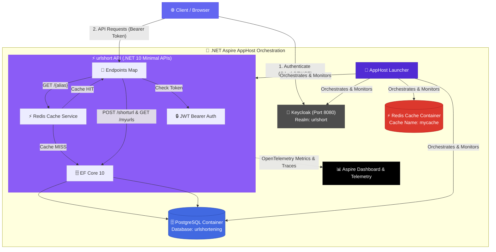
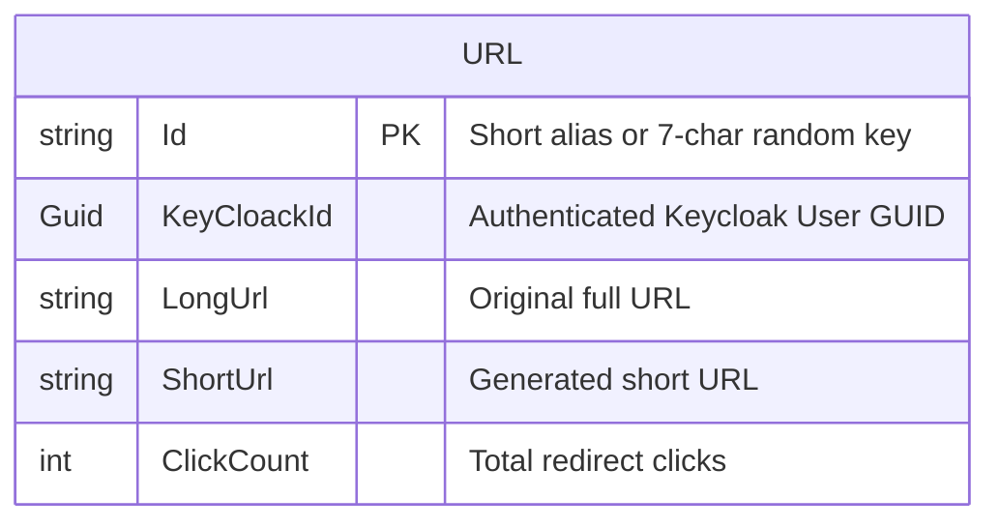

<div align="center">

<!-- Animated Header Banner -->


<!-- Typing Animation -->
<a href="#">
  
</a>

<br/>

<!-- Badges Row 1 -->
[](https://dotnet.microsoft.com/)
[](https://learn.microsoft.com/en-us/dotnet/aspire/)
[](https://www.keycloak.org/)
[](https://www.postgresql.org/)

<!-- Badges Row 2 -->
[](https://redis.io/)
[](https://docs.microsoft.com/ef/)
[](https://opentelemetry.io/)
[](#-license)

<br/>

<!-- Short Description -->
<p align="center">
  <strong>🌐 Modern, Cloud-Native RESTful API for URL Shortening & Analytics</strong><br/>
  <sub>Built with .NET 10 Minimal APIs • .NET Aspire Orchestration • Keycloak Identity • PostgreSQL • Redis Cache-Aside</sub>
</p>

[📌 Quick Start with Aspire](#-running-with-net-aspire-recommended) • [📡 API Endpoints](#-api-reference) • [🏗️ Architecture](#️-architecture) • [🇸🇦 الشرح بالعربية](#-دليل-التشغيل-والبدء-السريع-باللغة-العربية)


</div>

<br/>

## 🌟 Key Features

<table>
<tr>
<td width="50%">

### ⚡ Core Features
| Feature | Description |
|:---:|:---|
| 🔗 | **URL Shortening** — Convert long URLs to compact, shareable links |
| ✨ | **Custom Aliases** — Personalize short identifiers for your links |
| 🎲 | **Auto Generation** — 7-character random unique keys when alias is omitted |
| 📊 | **User Link Dashboard (`/myurls`)** — View all links created by the logged-in user |
| 📈 | **Click Counter** — Track redirect analytics per shortened link |

</td>
<td width="50%">

### 🛡️ Architecture & Security
| Feature | Description |
|:---:|:---|
| 🔮 | **.NET Aspire Orchestration** — One-command startup for Postgres, Redis, Keycloak & API |
| 🔐 | **Keycloak OAuth2 / OIDC** — Secure authentication & JWT Bearer authorization |
| ⚡ | **Redis Cache-Aside** — Distributed caching with TTL for high-speed redirects |
| 📊 | **OpenTelemetry & Health** — Live metrics, traces, `/health` & `/alive` endpoints |
| 📝 | **Swagger UI with PKCE** — Interactive OAuth2 authenticated docs at `/docs` |

</td>
</tr>
</table>

<br/>

## 🏗️ Architecture & Orchestration



<br/>

## 🧰 Tech Stack

<div align="center">

| Layer | Technology | Badge |
|:---:|:---|:---:|
| **Orchestrator** | .NET Aspire 13.4 |  |
| **Runtime** | .NET 10 |  |
| **Identity / Auth** | Keycloak (OAuth2 / OIDC) |  |
| **Framework** | ASP.NET Core Minimal APIs |  |
| **Database** | PostgreSQL |  |
| **ORM** | Entity Framework Core 10 |  |
| **Cache** | Redis Distributed Cache |  |
| **Observability** | OpenTelemetry (Logs, Metrics, Traces) |  |
| **API Documentation** | Swagger UI & OpenApi (OAuth2 + PKCE) |  |

</div>

<br/>

## 📁 Project Structure

```
🗂️ UrlShorteningService/
│
├── 🚀 urlshort.AppHost/                 # .NET Aspire Orchestration Host
│   ├── 🟢 AppHost.cs                   # Defines Postgres, Redis, Keycloak & API resources
│   ├── 📂 realms/                      # Keycloak Realm Configurations
│   │   └── realm-export.json           # Pre-configured 'urlshort' realm (imported automatically)
│   └── 📦 urlshort.AppHost.csproj
│
├── 🛡️ urlshort.ServiceDefaults/        # Shared Aspire Defaults
│   ├── 🟢 Extensions.cs                # OpenTelemetry, Health Checks & Resilience handlers
│   └── 📦 urlshort.ServiceDefaults.csproj
│
├── ⚡ urlshort/                         # Core API Application
│   ├── 📂 Cache/                       # Distributed Redis Caching Service
│   │   ├── IRedisCache.cs
│   │   └── RedisCache.cs
│   ├── 📂 Data/                        # DbContext & Database Models
│   │   └── ApplicationDbContext.cs
│   ├── 📂 Dtos/                        # Data Transfer Objects
│   ├── 📂 Endpoints/                   # Minimal API Route Endpoints
│   │   └── EndpointMap.cs              # POST /shorturl, GET /{alias}, GET /myurls
│   ├── 📂 Models/                      # Entity Framework Models (Url.cs)
│   ├── 🟢 Program.cs                   # App Entry Point, JWT Auth & OpenApi Configuration
│   └── 📦 urlshort.csproj
│
├── ⚙️ aspire.config.json               # Aspire Tooling Configuration
├── 📄 urlshort.slnx                    # Modern .NET Solution File
└── 📄 README.md                        # Project Documentation
```

<br/>

## 🚀 Running with .NET Aspire (Recommended)

**.NET Aspire** provides a seamless, zero-configuration local development experience. Running the `AppHost` automatically provisions and orchestrates **PostgreSQL**, **Redis**, **Keycloak**, and the **URL Shortener API**.

### 📋 Prerequisites

- [**.NET 10.0 SDK**](https://dotnet.microsoft.com/download) or later
- [**Docker Desktop**](https://www.docker.com/products/docker-desktop/) or **Podman** (must be running to host containers for PostgreSQL, Redis, and Keycloak)

---

### ⚙️ Step-by-Step Instructions

<details open>
<summary><b>📥 Step 1 — Clone the Repository</b></summary>

```bash
git clone https://github.com/Mesh4All99/UrlShorteningService.git
cd UrlShorteningService
```

</details>

<details open>
<summary><b>▶️ Step 2 — Start the Solution via .NET Aspire</b></summary>

Run the following single command from the project root:

```bash
dotnet run --project urlshort.AppHost
```

> 💡 **Using Visual Studio / Rider / VS Code:** Set `urlshort.AppHost` as your **Startup Project** and press `F5` or `Ctrl + F5`.

</details>

<details open>
<summary><b>🎉 Step 3 — Access Aspire Dashboard & Services</b></summary>

When Aspire starts, it launches the **Aspire Dashboard** automatically in your default browser (or prints the login link in your console):

| Resource | Description | Endpoint |
|:---|:---|:---:|
| 📊 **Aspire Dashboard** | Monitor traces, logs, metrics & container states | Printed in console (e.g. `https://localhost:17189`) |
| 📖 **API Docs (Swagger UI)** | Interactive OpenAPI documentation with OAuth2 PKCE login | Click **API Docs** link in Aspire or visit `/docs` |
| 🔐 **Keycloak Identity** | Pre-configured authentication realm (`urlshort`) | `http://localhost:8080` |
| 🗄️ **PostgreSQL & Redis** | Containers with persistent volumes initialized automatically | Managed by Aspire |

</details>

> [!TIP]
> **Automatic Database Migrations & Realm Import:**
> - Aspire automatically imports the `./realms/realm-export.json` file into Keycloak on startup.
> - The API automatically checks and applies pending EF Core migrations on startup using `GetPendingMigrationsAsync()`.

<br/>

## 🛠️ Running Standalone (Without Aspire AppHost)

If you prefer to host your own PostgreSQL, Redis, and Keycloak instances manually:

1. **Update Connection Strings & Auth Settings** in `urlshort/appsettings.json`:
   ```json
   {
     "ConnectionStrings": {
       "Default": "Host=localhost; Port=5432; Database=UrlShorterDb; Username=postgres; Password=YOUR_PASSWORD;",
       "Redis": "localhost:6379"
     },
     "Authentication": {
       "ValidIssuer": "http://localhost:8080/realms/urlshort",
       "Audience": "account"
     }
   }
   ```

2. **Apply Database Migrations:**
   ```bash
   dotnet ef database update --project urlshort
   ```

3. **Run the API:**
   ```bash
   dotnet run --project urlshort
   ```

<br/>

## 🔐 Authentication & Keycloak Integration

The endpoints `/shorturl` and `/myurls` are secured with **JWT Bearer Authentication** using Keycloak.

### 🔑 Keycloak Configuration Summary

| Setting | Value |
|:---|:---|
| **Realm Name** | `urlshort` |
| **Client ID** | `urlshort` |
| **Keycloak URL** | `http://localhost:8080` (or `https://localhost:8080`) |
| **OIDC Discovery** | `/realms/urlshort/.well-known/openid-configuration` |

### 🧪 Authenticating via Swagger UI (`/docs`)

1. Open `/docs` in your browser.
2. Click the **Authorize** button in Swagger UI.
3. Use PKCE OAuth2 flow to log in via Keycloak.
4. Once authorized, execute requests to `/shorturl` or `/myurls` seamlessly!

<br/>

## 📡 API Reference

### 1. 🔗 Shorten a URL (Authenticated)

```http
POST /shorturl
Authorization: Bearer <YOUR_JWT_TOKEN>
Content-Type: application/json
```

<table>
<tr>
<td width="50%">

**📤 Request Body (With Custom Alias)**
```json
{
  "url": "https://github.com/Mesh4All99/UrlShorteningService",
  "alias": "my-repo"
}
```

</td>
<td width="50%">

**📥 Response** `200 OK`
```json
{
  "shortenUrl": "https://localhost:7xxx/my-repo"
}
```

</td>
</tr>
</table>

> [!NOTE]
> - If `alias` is omitted, a random 7-character string will be generated automatically.
> - The link is saved and associated with your Keycloak User ID (`KeyCloackId`).

---

### 2. 🔄 Redirect to Original URL (Public)

```http
GET /{alias}
```

| Parameter | Type | Description |
|:---:|:---:|:---|
| `alias` | `string` | **Required**. Short link identifier |

> **Response:** `302 Found` — Redirects immediately to the long URL and increments `ClickCount`.

> [!TIP]
> **Cache-Aside Flow:**
> 1. API checks Redis for `alias`.
> 2. On **HIT** → Increments click count in DB & returns 302 redirect.
> 3. On **MISS** → Queries PostgreSQL, stores entity in Redis cache, increments click count, and returns 302 redirect.

---

### 3. 📊 Get My URLs (Authenticated)

```http
GET /myurls
Authorization: Bearer <YOUR_JWT_TOKEN>
```

**📥 Response** `200 OK`
```json
[
  {
    "shorturl": "https://localhost:7xxx/my-repo",
    "longurl": "https://github.com/Mesh4All99/UrlShorteningService"
  }
]
```

<br/>

## 📊 Database Schema



<br/>

---

## 🇸🇦 دليل التشغيل والبدء السريع (باللغة العربية)

يقدم هذا المشروع خدمة اختصار الروابط عالية الأداء مبنية بأحدث تقنيات **.NET 10 Minimal APIs**، ومدمجة بالكامل مع **.NET Aspire** لإدارة الحاويات والخدمات بسهولة تامة.

### 🌟 أبرز التحديثات والمميزات:
1. **التشغيل الموحد باستخدام .NET Aspire**: يتم تشغيل قاعدة البيانات (PostgreSQL)، التخزين المؤقت (Redis)، ومزود الهوية (Keycloak)، والتطبيق (API) بأمر واحد فقط!
2. **المصادقة والأمان عبر Keycloak**: حماية مسارات إنشاء الروابط وعرض روابط المستخدم باستخدام توكنات JWT Bearer.
3. **التخزين المؤقت (Redis Cache-Aside)**: زيادة سرعة التحويل السريع لـ 302 وتقليل الضغط على قاعدة البيانات.
4. **عرض روابط المستخدم (`GET /myurls`)**: مسار جديد يتيح للمستخدم المسجل رؤية جميع الروابط التي قام باختصارها.
5. **مراقبة الأداء OpenTelemetry**: لوحة تحكم كاملة للمراقبة والـ Metrics وتتبع الأخطاء عبر Aspire Dashboard.

### 🚀 خطوات التشغيل باستخدام Aspire:
1. **تأكد من تشغيل Docker Desktop** على جهازك.
2. **افتح التيرمنال في مجلد المشروع** وقم بتشغيل الأمر:
   ```bash
   dotnet run --project urlshort.AppHost
   ```
3. **ستفتح لك لوحة تحكم Aspire Dashboard تلقائياً** في المتصفح.
4. يمكنك الضغط على رابط **API Docs** للانتقال إلى التوثيق التفاعلي (`/docs`) وتجربة الأوامر والمصادقة بسهولة!

---

<br/>

## 🤝 Contributing

Contributions are welcome! Feel free to open issues and pull requests to improve the project.

<div align="center">

[](https://github.com/Mesh4All99/UrlShorteningService/issues)
[](https://github.com/Mesh4All99/UrlShorteningService/issues)

</div>

<br/>

## 📄 License

This project is open-source and available under the [MIT License](LICENSE).

<br/>

<!-- Footer Wave -->


<div align="center">

**⭐ If you found this project helpful, give it a star!**

<br/>

Made with ❤️ using **.NET 10** & **.NET Aspire**

</div>
