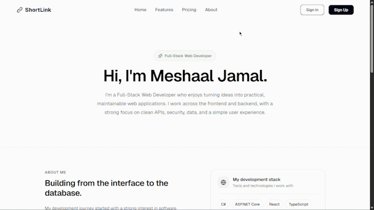
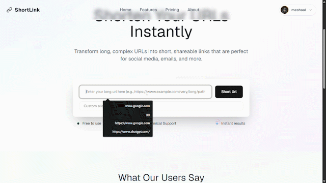
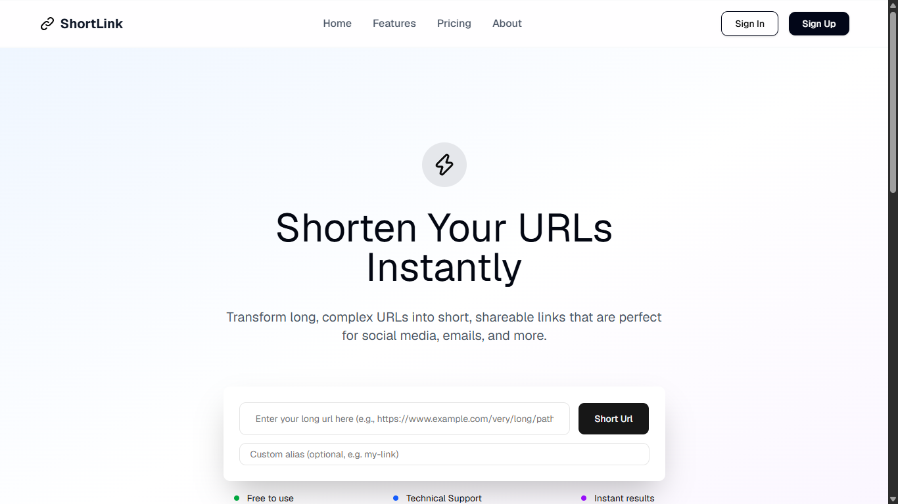
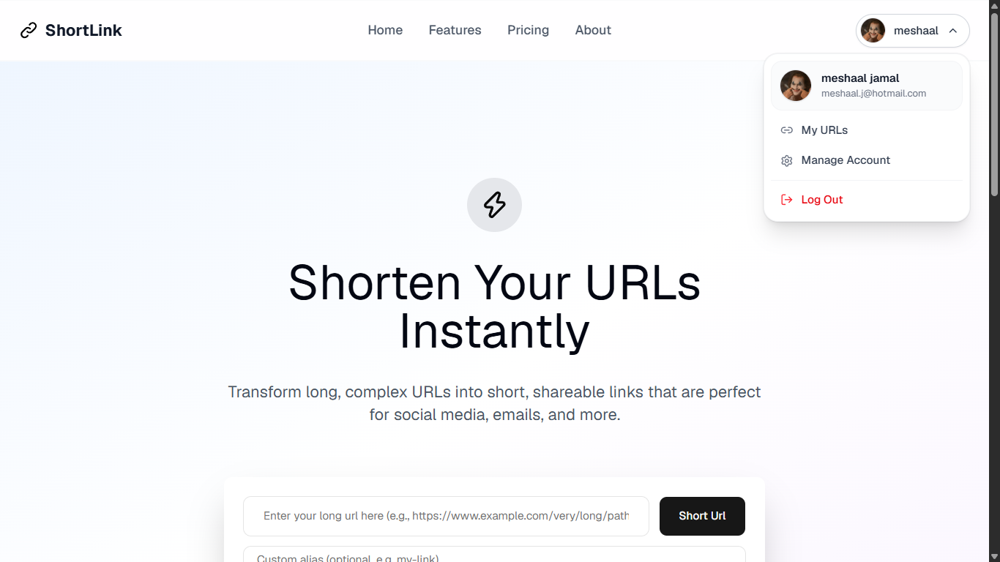
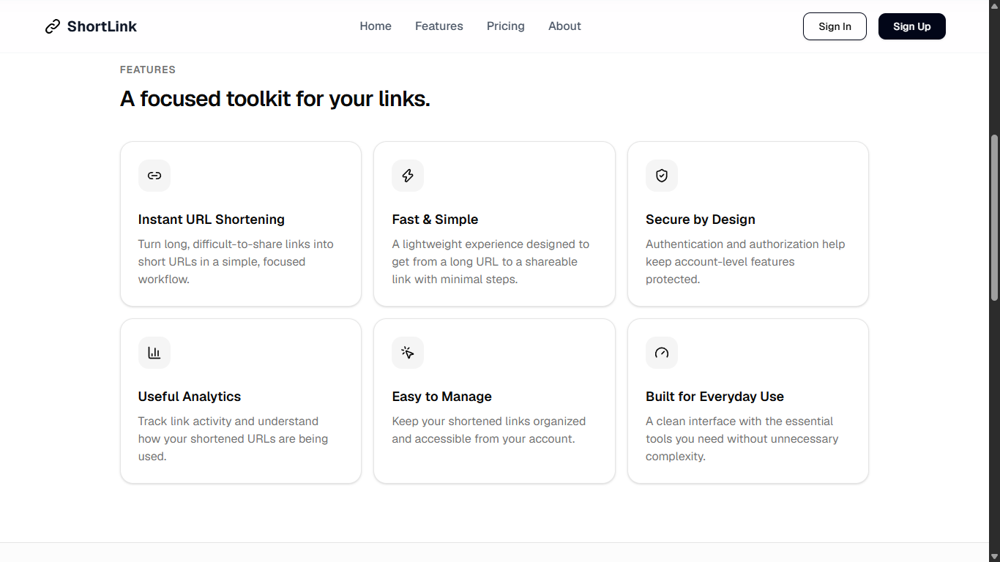
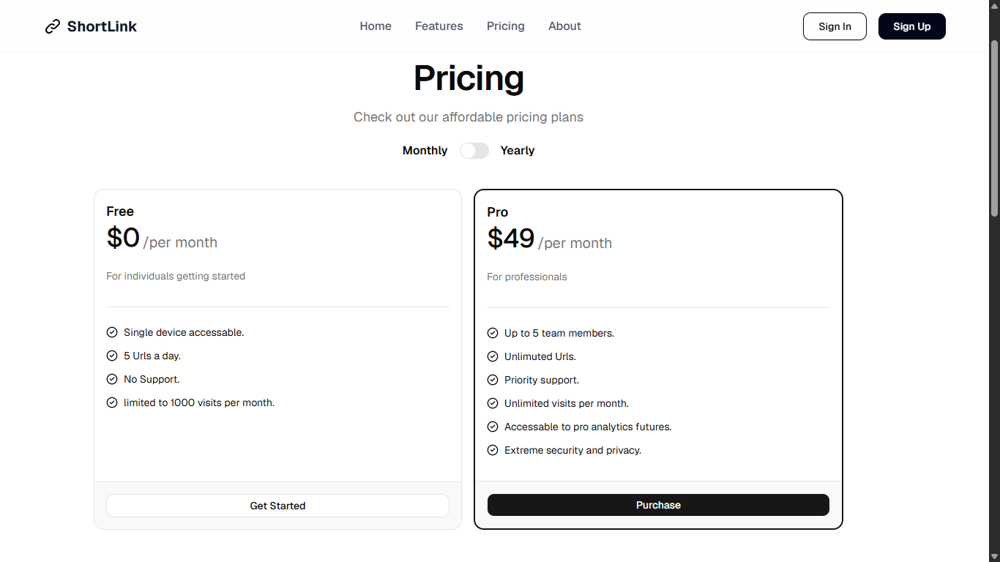
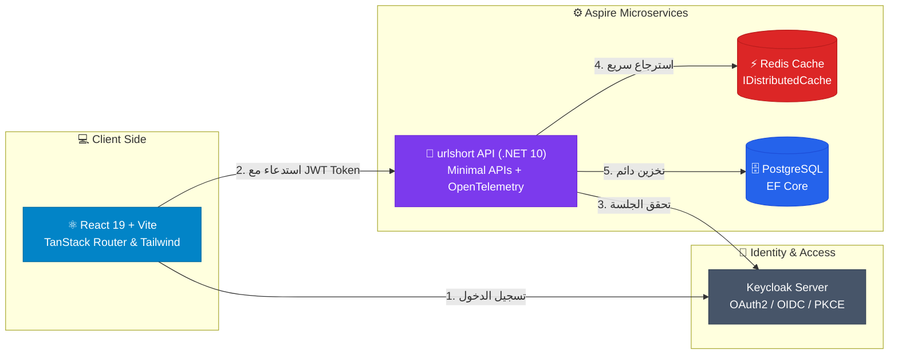
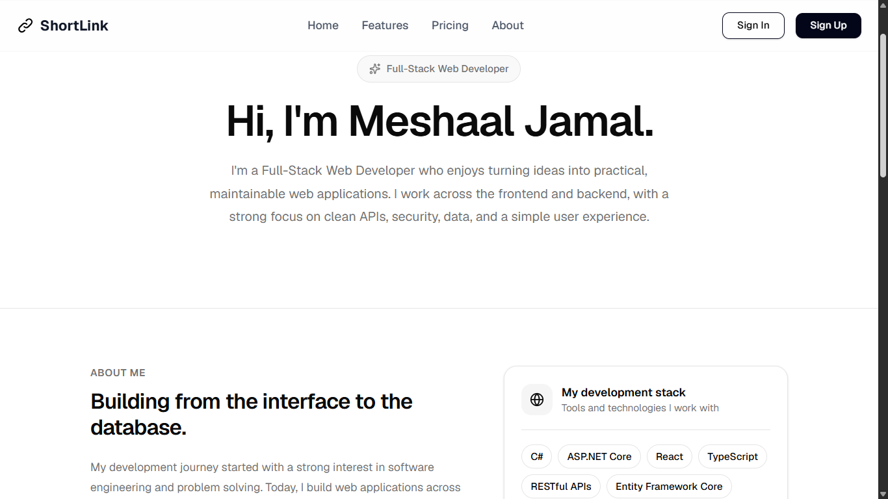

<div dir="rtl" align="center">

# 🔗 ShortLink — Distributed URL Shortener

### منصة متكاملة وسريعة لتقصير الروابط وتتبعها، مبنية بمعمارية سحابية موزعة عبر **.NET Aspire** وواجهة **React 19** الحديثة ومحمية بـ **Keycloak**.

<br/>

[](https://dotnet.microsoft.com/)
[](https://learn.microsoft.com/en-us/dotnet/aspire/)
[](https://react.dev/)
[](https://www.typescriptlang.org/)
[](https://www.keycloak.org/)
[](https://www.postgresql.org/)
[](https://redis.io/)
[](https://tailwindcss.com/)

<br/>

<!-- Flagship Demo GIF -->


<br/>

</div>

---

<div dir="rtl">

## ⚡ أبرز المزايا البصرية

| 🚀 السرعة والتحويل الفوري | 🔐 أمان واحترافية | 📊 إدارة وتحليلات مباشرة | 📱 مشاركة سريعة بـ QR |
| :---: | :---: | :---: | :---: |
| كاش فائق السرعة عبر **Redis** لإعادة توجيه لحظية دون استنزاف قاعدة البيانات. | مصادقة قوية ببروتوكول **OAuth 2.0 / OpenID Connect + PKCE** بواسطة **Keycloak**. | لوحة تحكم تعرض روابطك مع عداد نقرات متزامن في الوقت الفعلي. | توليد فوري لرموز **QR Code** ونسخ الروابط المخصصة بضغطة زر. |

<br/>

### 🎬 تجربة التخصيص والتحليلات الحية (Live Interaction & Analytics)

</div>

<div align="center">
  
</div>

<br/>

---

<div dir="rtl">

## 📸 معرض الواجهات — Visual Showcase

</div>

<div align="center">

| 🌐 الواجهة الرئيسية (Landing Page) | 👤 حساب المستخدم والجلسة (User Profile) |
| :---: | :---: |
|  |  |

| 🛠️ بطاقات المزايا (Features Grid) | 💳 خطط الأسعار (Pricing Plans) |
| :---: | :---: |
|  |  |

</div>

<br/>

---

<div dir="rtl">

## 🏗️ المعمارية وتدفق البيانات — Architecture

يعمل المشروع بنموذج الخدمات السحابية الموزعة المدارة بالكامل عبر **.NET Aspire AppHost**:

</div>


```mermaid
graph LR
    subgraph UI ["💻 Client Side"]
        ReactApp["⚛️ React 19 + Vite<br/>TanStack Router & Tailwind"]
    end

    subgraph Auth ["🔐 Identity & Access"]
        KC["Keycloak Server<br/>OAuth2 / OIDC / PKCE"]
    end

    subgraph Backend ["⚙️ Aspire Microservices"]
        API["🚀 urlshort API (.NET 10)<br/>Minimal APIs + OpenTelemetry"]
        Redis[("⚡ Redis Cache<br/>IDistributedCache")]
        Postgres[("🗄️ PostgreSQL<br/>EF Core")]
    end

    ReactApp -->|"1. تسجيل الدخول"| KC
    ReactApp -->|"2. استدعاء مع JWT Token"| API
    API -->|"3. تحقق الجلسة"| KC
    API -->|"4. استرجاع سريع"| Redis
    API -->|"5. تخزين دائم"| Postgres

    style ReactApp fill:#0284c7,stroke:#0369a1,color:#fff
    style KC fill:#475569,stroke:#334155,color:#fff
    style API fill:#7c3aed,stroke:#6d28d9,color:#fff
    style Redis fill:#dc2626,stroke:#b91c1c,color:#fff
    style Postgres fill:#2563eb,stroke:#1d4ed8,color:#fff
```

---

<div dir="rtl">

## 📡 نقاط النهاية — API Endpoints

| الطريقة | نقطة النهاية | الوصف | الحماية |
| :--- | :--- | :--- | :---: |
| `POST` | `/shorturl` | إنشاء رابط مختصر جديد (عشوائي 7 خانات أو Custom Alias) | 🔒 Bearer JWT |
| `GET` | `/{alias}` | تحويل فوري للرابط الأصلي وتحديث عداد الزيارات عبر الكاش | 🌐 عام |
| `GET` | `/myurls` | استعراض كافة الروابط الخاصة بالمستخدم الحالي مع إحصائيات النقرات | 🔒 Bearer JWT |
| `DELETE` | `/{id}` | حذف رابط مختصر يملكه المستخدم | 🔒 Bearer JWT |

<br/>

---

## 🚀 التشغيل السريع — Quick Start

### 1️⃣ المتطلبات المسبقة
- **Docker Desktop** (لتشغيل حاويات PostgreSQL, Redis, Keycloak)
- **.NET 10 SDK** + Aspire Workload
- **Node.js 20+**

### 2️⃣ خطوات التشغيل

```bash
# تشغيل جميع خدمات الباك إند عبر .NET Aspire
dotnet run --project urlshort.AppHost
```

```bash
# تشغيل واجهة المستخدم React (في نافذة تيرمينال أخرى)
cd urls
npm install
npm run dev
```

> 💡 **لوحة تحكم Aspire Dashboard:** ستفتح تلقائياً عند التشغيل لمراقبة السجلات (Logs)، التتبعات (Traces)، والخدمات النشطة.

---

## 👨‍💻 المطور — Developer

<div align="center">
  
</div>

<br/>

<div align="center">

صُمم وطُوّر بواسطة **مشعل جمال (Meshaal Jamal)** — مهندس برمجيات Full-Stack 🚀

</div>

</div>
